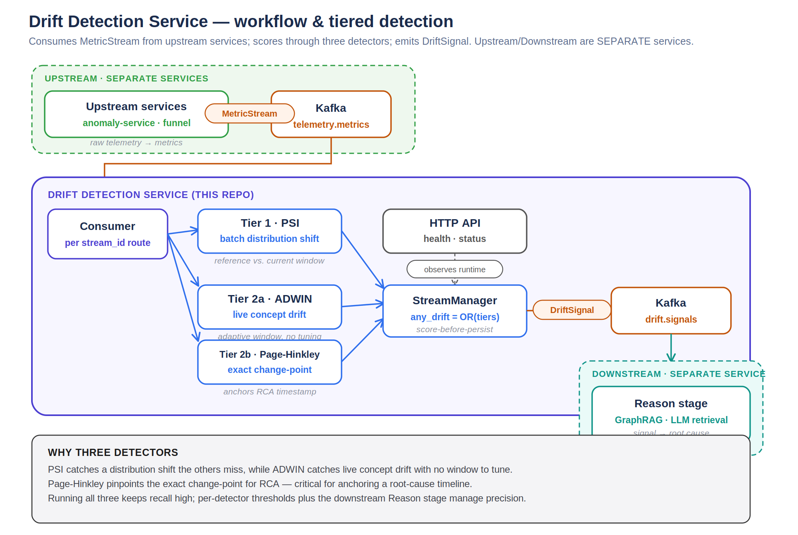

# drift-detection-service

Independent microservice that detects **data drift**, **concept drift**, and
**change-points** for streaming AIOps metrics — built as the drift-monitoring
piece of the ARIES NetworkOps closed-loop pipeline (Observe → Detect → Reason
→ Decide → Act → Verify → **Learn**).

It ships three detectors, each solving a different question:

| Detector | Question it answers | Style | Algorithm |
|---|---|---|---|
| **PSI** | "Has this metric's *distribution* shifted vs. a reference baseline?" | Batch / windowed | Population Stability Index |
| **ADWIN** | "Is this stream drifting *right now*, without me choosing a window size?" | Streaming, point-by-point | Adaptive Windowing |
| **Page-Hinkley** | "Exactly *when* did a sustained shift begin?" | Streaming, point-by-point | Cumulative sum change-point test |

## Why three detectors instead of one

- **PSI** needs a batch of values to compare against a reference — it's cheap
  and interpretable (thresholds: `<0.10` stable, `0.10–0.25` moderate,
  `≥0.25` significant) but can't tell you about drift mid-window.
- **ADWIN** adapts its own window size using a statistical test, so you don't
  have to tune a fixed window — good default for "is something changing" on
  a continuous stream (e.g. per-tick anomaly scores).
- **Page-Hinkley** is a sequential cumulative-sum test. It's slower to reset
  after firing but pinpoints the moment a sustained shift started — exactly
  what an RCA copilot needs to anchor a "drift began at 14:32" narrative.

ADWIN and Page-Hinkley are complementary, not redundant: run both on the same
stream and you get both "drift is happening" and "here's when it started."

## Architecture



See [`ARCHITECTURE.md`](./ARCHITECTURE.md) for the full request-flow diagram
and the reasoning behind the point-by-point vs. batch split, the
StreamManager design, and the Redis persistence tradeoffs.

```
                     ┌─────────────────────────┐
  Redis tumbling ───▶│  POST /streams/update    │──▶ ADWIN + Page-Hinkley
  window / Kafka      │  (point-by-point)        │    (per-stream state)
  consumer            └─────────────────────────┘
                     ┌─────────────────────────┐
  CMDB contract ─────▶│ POST /streams/          │──▶ PSI
  validation batch    │ update-batch-psi        │    (per-stream state)
                     └─────────────────────────┘
                                │
                                ▼
                    any_drift=true signal
                                │
                                ▼
              feeds back into "Reason" stage / alerting
```

Each metric stream (e.g. `iface.eth0.latency_ms`) is registered once with the
detectors you want, then fed values as they arrive. State lives in-process by
default (fast, fine for a single replica); set `DRIFT_REDIS_URL` to persist
detector state across restarts or share it across replicas (best-effort
pickle snapshot on every update — not a source of truth, just a warm cache).

## Quick start

```bash
pip install -r requirements-dev.txt
uvicorn app.main:app --reload          # http://localhost:8000/docs for Swagger UI
pytest -q                              # 14 tests, all detector + API paths
```

With Docker:

```bash
docker compose up --build              # service on :8000, Redis on :6379
```

## API walkthrough

**1. Register a stream** — choose detectors, tune thresholds:

```bash
curl -X POST localhost:8000/streams/register -H "Content-Type: application/json" -d '{
  "stream_id": "iface.eth0.latency_ms",
  "detectors": ["adwin", "page_hinkley"],
  "page_hinkley_threshold": 20,
  "page_hinkley_mode": "up"
}'
```

**2. Feed values as they arrive** (from your reduction-funnel / anomaly-service pipeline):

```bash
curl -X POST localhost:8000/streams/update -H "Content-Type: application/json" -d '{
  "stream_id": "iface.eth0.latency_ms", "value": 42.7
}'
```

Response tells you if either detector fired:
```json
{
  "stream_id": "iface.eth0.latency_ms",
  "timestamp": "2026-07-04T02:10:00Z",
  "signals": [
    {"detector": "adwin", "drift_detected": false, "details": {"estimation": 12.1, "width": 340}},
    {"detector": "page_hinkley", "drift_detected": true, "details": {"n_updates": 341}}
  ],
  "any_drift": true
}
```

**3. PSI needs a reference baseline up front, then batches to compare:**

```bash
curl -X POST localhost:8000/streams/register -H "Content-Type: application/json" -d '{
  "stream_id": "cmdb.contract.field_count",
  "detectors": ["psi"],
  "psi_reference_values": [/* last week's values */]
}'

curl -X POST localhost:8000/streams/update-batch-psi -H "Content-Type: application/json" -d '{
  "stream_id": "cmdb.contract.field_count",
  "values": [/* this window's values */]
}'
```

**4. Check cumulative stats for a stream:**

```bash
curl localhost:8000/streams/iface.eth0.latency_ms/status
```

## Configuration

All env vars are prefixed `DRIFT_` (see `app/config.py`):

| Variable | Default | Purpose |
|---|---|---|
| `DRIFT_REDIS_URL` | unset (in-process only) | Persist/share detector state |
| `DRIFT_API_KEY` | unset (no auth) | If set, all endpoints except `/healthz`/`/readyz` require `x-api-key` header |
| `DRIFT_LOG_LEVEL` | `INFO` | Logging verbosity |

## Deployment

- `Dockerfile` — multi-stage, non-root user, built-in healthcheck.
- `docker-compose.yml` — local dev with Redis.
- `helm/drift-detection-service/` — Deployment, Service, optional HPA.
- `.github/workflows/ci.yml` — runs pytest on every push/PR, builds & pushes
  to GHCR on merge to `main`.

> Note: this repo's tests were run and passing (`14 passed`) in a sandbox
> without Docker available, so build the image locally (`docker build .`)
> and smoke-test the container before your first deploy.

## Where this plugs into Architecture

Register one stream per metric you already track in your Redis tumbling
windows or Feast feature store — anomaly scores from `anomaly-service`,
funnel-stage counts from `reduction-funnel`, or CMDB field-contract checks.
When `any_drift: true` comes back, that's your signal to route into the
**Reason** stage (re-baseline the EWMA z-score detector, flag the CMDB
contract for review, or open an RCA thread with the Page-Hinkley timestamp
as the anchor).
